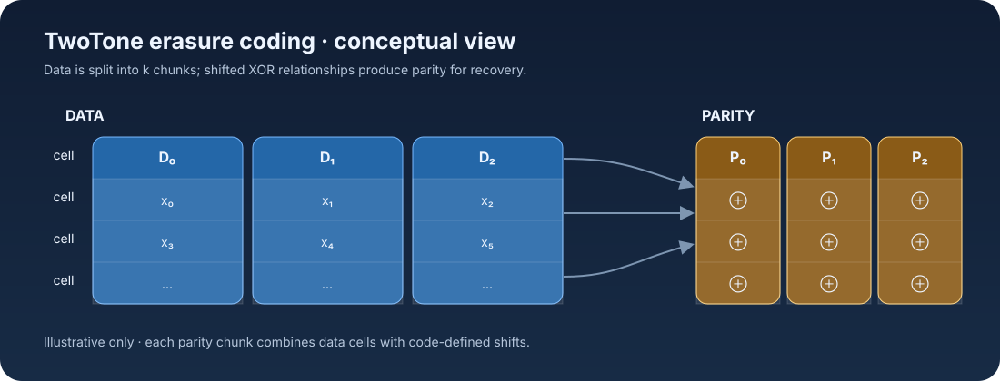
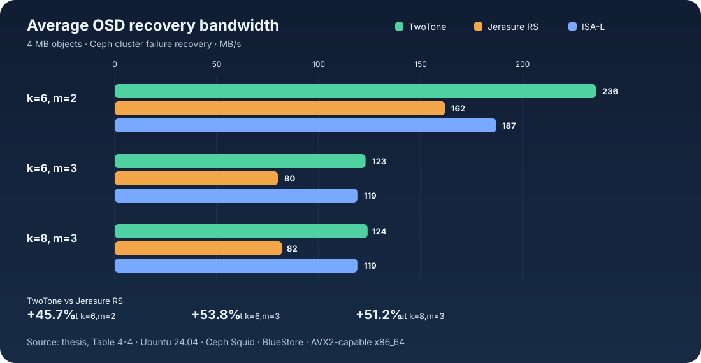

# TwoTone Erasure Coding in Ceph

**An implementation of the TwoTone erasure code as a native Ceph storage plugin.**

This repository is based on Ceph and contains my implementation, optimization, and integration work for TwoTone erasure coding, based on the [Two-tone Shift-XOR Storage Codes paper](https://guoyuanxinkevin.github.io/two_tone.pdf). The plugin can encode data into parity chunks and reconstruct missing chunks through Ceph's erasure-code interface.

[Read the thesis](Thesis-Implementation-of-Ceph-Twotone-Codes.pdf) · [Browse the implementation](src/erasure-code/twotone/) · [See the tests](src/test/erasure-code/TestErasureCodeTwotone.cc)



## Outperforming Established Ceph EC Plugins

This work targets Ceph Squid, where Jerasure Reed–Solomon is the default erasure-code plugin ([Squid profile docs](https://docs.ceph.com/en/squid/rados/operations/erasure-code-profile/)). Current Ceph Tentacle releases use ISA-L as the default for new erasure-coded pools ([release notes](https://docs.ceph.com/en/latest/releases/tentacle/)); it is a strong performance baseline. In the thesis's cluster-level OSD failure tests with 4 MB objects, TwoTone delivered **45.7%–53.8% higher average recovery bandwidth than Jerasure Reed–Solomon** across three configurations and edged out ISA-L in all three.



These are system recovery results, not codec-only microbenchmarks. The thesis reports a Ceph Squid development build on Ubuntu 24.04 with BlueStore and AVX2; the cluster used 10 OSDs for `k=6` tests and 12 OSDs for `k=8,m=3`. See the [thesis evaluation](Thesis-Implementation-of-Ceph-Twotone-Codes.pdf) for the methodology and full results.

## What I built

- **Ceph erasure-code plugin:** Added the `twotone` plugin, its profile parsing, chunk sizing, encoding, and decoding paths, and registered it in the Ceph build.
- **TwoTone layout and recovery:** Implemented the shifted XOR layout and recovery planning for supported `k` and `m` configurations. The implementation validates that `m` does not exceed `k`.
- **Encoding performance work:** Added SIMD-aware XOR routines with AVX2 and SSE2 paths and a portable fallback. The implementation also reuses scratch space and plans recovery operations to reduce repeated work.
- **Correctness coverage:** Added tests that encode and reconstruct missing chunks for multiple configurations, including checks against the original data and parity.
- **Cluster-level exercise script:** Added `twotone_robustness.sh` to exercise object writes, reads, benchmark smoke checks, and recovery after an OSD failure in a local Ceph cluster.

## Why this work matters

Erasure coding can reduce storage overhead compared with keeping full replicas, while adding computation and recovery complexity. This project explores how a TwoTone code can be implemented within Ceph's existing erasure-code architecture and exercised through both unit-level and cluster-level workflows.

The repository includes the thesis for the algorithm background, design choices, and evaluation. Performance depends on the hardware, build options, and benchmark setup; see the paper for the measured results and methodology.

## Source map

| Area | Location |
| --- | --- |
| Thesis and evaluation | [`Thesis-Implementation-of-Ceph-Twotone-Codes.pdf`](Thesis-Implementation-of-Ceph-Twotone-Codes.pdf) |
| Ceph plugin implementation | [`src/erasure-code/twotone/`](src/erasure-code/twotone/) |
| Unit tests | [`src/test/erasure-code/TestErasureCodeTwotone.cc`](src/test/erasure-code/TestErasureCodeTwotone.cc) |
| Cluster robustness workflow | [`twotone_robustness.sh`](twotone_robustness.sh) |

## Build and run

The commands below assume a configured Ceph development build. Ceph's full build prerequisites are documented in the [upstream Ceph README](https://github.com/ceph/ceph#building-ceph).

Build the plugin and its unit test from the build directory:

```sh
ninja ec_twotone unittest_erasure_code_twotone
```

Run the unit test:

```sh
./bin/unittest_erasure_code_twotone
```

The cluster workflow is provided in [`twotone_robustness.sh`](twotone_robustness.sh). It starts a local `vstart` cluster and exercises object I/O and recovery; its comments describe the expected cluster setup.

## Acknowledgements

Ceph is an open-source distributed storage system. This repository is a research and thesis implementation built on the Ceph codebase; refer to the repository's [`COPYING`](COPYING) file for licensing details.
